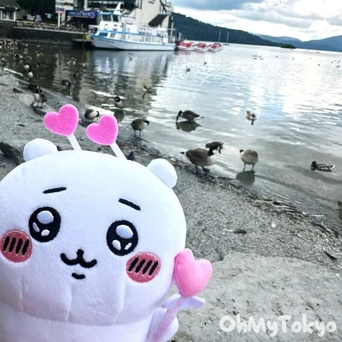
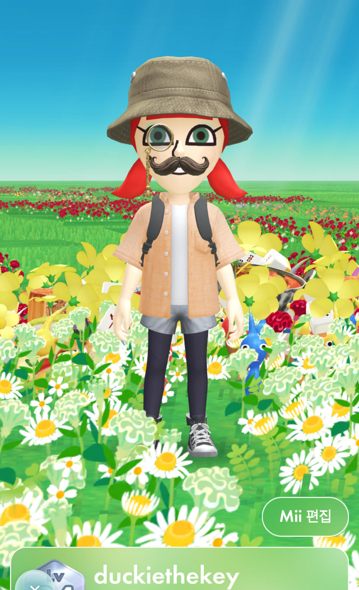

# Homework One

## Jake Clarke

### Background

Was a student for one and half years within the animation program at Fanshawe College and now I am currently enrolled in the Interactive Media program in Fanshawe College where I am learning website design and coding.

### Hobbies

I enjoy tabletop games such as Dungeons and Dragons especially with my friends, I also happen to enjoy video games, any genre really I'm not too picky so long as it's something fun to occupy my time with. Reading and art are also things I enjoy to do in my free time as well.

### Skills

- Digital and Traditional Art
- Multitasking
- Overexplaining
- Sleeping for long periods of time

### Likes

1. Cats
2. Sleeping
3. Videogames
4. Music
5. Art
6. Chiikawa
7. Garfield 

---

## Hee Jin Cheon

### Background

I majored in Fashion Design and worked in the fashion industry in Korea  
for nearly 20 years — 9 years as a vendor designer and 11 years as a trend researcher. Each career shift showed me the importance of learning new skills.  
Now, I'm here to grow, explore, and expand my path.

### Hobbies

I enjoy gaming, especially Pikmin Bloom, which I've played since it launched 3years ago. It’s a walking game where I spread flowers as I explore the world. 🌸 I also sew simple items like pajamas for my son and cushions, to keep my sewing skills fresh.

### Skills

- Fashion trend research
- Sewing simple items
- What I remember from my fashion background
- Watching TV for endless hours (No need for food, just remote control)

### Likes

1. Fashion
2. My Family
3. Pikmin Bloom
4. Flowers & Flower patterns
5. Learning something new
6. Exploring Google map